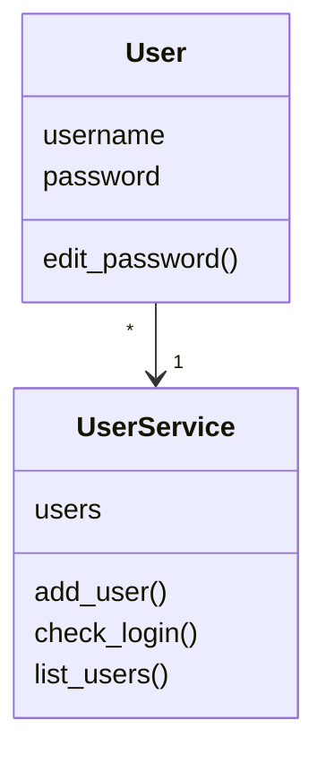

# Arkkitehtuurikuvaus

## Rakenne
_BudgetService_ - Budjettiin liittyvä logiikka
_UI_ - Käyttäjän kanssa kommunikointi (ja toistaiseksi ohjelman ohjaamiseen liittyvä toiminta)
_User_ ja _UserService_ Käyttäjään liittyvät toimenpiteet

## Sovelluslogiikka
Vielä toistaiseksi sovellus pyörii pääosin UI:ssa. Tarkoituksena on siirtää toimenpiteet ja sovelluksen pyörittäminen toiseen luokkaan, ja jättää pelkästään käyttäjän kanssa kommunikoiminen UI:hin. 

Yksittäisistä käyttäjistä vastaa luokka User (user.py), ja näistä kaikista Usereista vastaa UserService(user_service.py). Budjetteja on tällä hetkellä mahdollista luoda vain yksi kappale, josta vastaa BudgetService(budget_service.py)
Luokkakaavio:

Sekvenssikaavio luokista User ja UserService:
